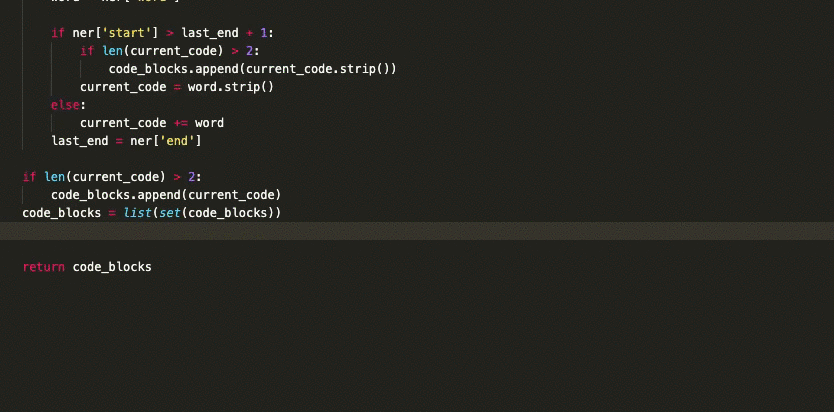

# </> Codesearch

Quickly search for code snippets from wherever you are, no need to switch to the browser and disrupt your flow:



## Installation

You will need Python 3. Then clone this repo and install the dependencies:

```bash
git clone https://github.com/rogeriochaves/codesearch.git
cd codesearch
pip3 install -r requirements.txt
```

### Method 1: Local running model

This approach is the quickest way to get started, it has the advantage of everything local, no registration needed anywhere and no warmup needed after starting the server. The disadvantage is that you have to download a ~500MB model, plus leave a server running on the background which takes ~1GB of RAM

Try it out immediately (it will download the model on the first run):

```bash
python3 codesearch/cli.py bash replace text in file
```

The CLI initializes the model all the time, to leave it running for faster searches, start the server:

```bash
python3 codesearch/server.py
```

Now in another terminal you can curl it anytime:

```bash
curl "localhost:2633/?q=bash+replace+text+in+file"
```

#### Alfred Integration

This is the best way to use Codesearch, it allows you to search with a shortcut from anywhere you are on the computer, but you will need to have Alfred with Powerpack (£29 one time payment)

Just import the Codesearch.alfredworkflow to your Alfred and that's it!

Press Option + Space to use Codesearch, or type "how <query>" on regular alfred search box

To always have the server running in the background after restarting the computer, you can go to Mac Preferences > Users & Groups > Login Items tab, click + and add the codesearch/CodesearchServer.app file

### Method 2: 🤗 Hugging Face Inference API

This approach has the advantage of not needing to leave a server running and not eating up your RAM, but it will require ~10s warmup time from Hugginface after a long time of no use

To use is first [create an account at Huggin Face](https://huggingface.co/join) and get your API Token.

Then, simply set the API_TOKEN env var:

```bash
export API_TOKEN=huggingface_token_here
python3 codesearch/cli.py bash replace text in file
```

Try it a second time, after warmup this is way fast

#### Alfred Integration

To use your API Token also at Alfred Integration, after importing Codesearch.alfredworkflow go to Alfred Preferences > Workflows > Codesearch and click on the \[X\] button on the top-right, then on the Environment Variables section add two env variables:

```
API_TOKEN: paste your hugging faces API Token
CODESEARCH_PATH: /path/where/you/cloned/codesearch
```

### Method 3: Self-hosted

If you have a server available you can leave codesearch running there, this has the advantage of not needing warmup time from Hugginface, but the cost of leave a server running. There is a Dockerfile at the repo to facilitate the integration.

Then, for Alfred to work with it, just like on the Method 2, add this env variable to the workflow:

```
SERVER_URL: https://yourserver.com/
```

Have fun!
