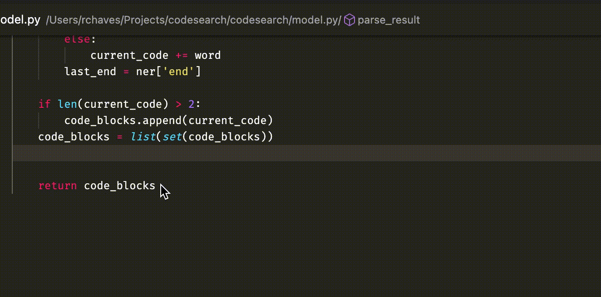

# codesearch README

Quickly search for code snippets from VS Code, no need to switch to the browser and disrupt your flow:



## Requirements

You will need to have Python 3 installed in your system

## How it works

Behind the scenes, Codesearch does a Google search for you, then it takes the search results text and pipe it through a [deep learning model](https://huggingface.co/mrm8488/codebert-base-finetuned-stackoverflow-ner) which extracts code pieces out of the search results. Because of that, it needs to first download the model on the first run (~500mb).

Press Alt+Space (Option+Space on Mac) to trigger Codesearch. If it's not working because you have a conflicting shortcut, press Ctrl+Shift+P (Cmd+Shift+P on Mac), search for Open Keyboard Shortcuts (JSON) and add this at the end:

```json
{
  "key": "alt+space",
  "command": "codesearch.openSearchBox"
}
```

### For more information and support

- [Github Repo](https://github.com/rogeriochaves/codesearch)

**Enjoy!**
